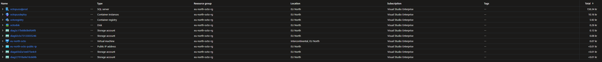
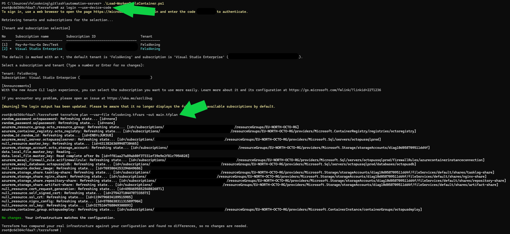

# automation-server
The Terraform Pipeline Used to Deploy the Octopus Deploy Server to Azure via Azure Container Group.

🄯 2025 Felsökning/Felsokning. All rights reserved.

# TODO:
- Need to implement optional state file storage in an Azure Storage Account
    * Terraform state is only being maintained via files generated from the process and stored in this root folder (ignored in `.gitignore`).
        * State will be important for production scenarios.
- Need to investigate using Traefik (replacing NGINX), given they can retrive certificates from Let's Encrypt.
    * This will deprecate the certificate steps; so not a small change.

# Cost Implications
Deploying an Octopus Deploy Server via this means costs an average of 3.24SEK/day (or €0.03/day); however, the larget cost implications will come from the SQL Server.

# Building Your Own Octopus Deploy Server in Azure with this Terraform definition
These are the steps required to build your own Octopus Deploy Server in Azure using this pipeline.

## Azure Subscription
You will need a subscription in Azure to target the deployments against.

## Execution Context
You will need to use a docker container that contains all of the tools (e.g.: az cli, docker, etc.) to perform the deployment. You can also use a GitHub Runner or you own local machine.

At minimum, you will need:

- Terraform 1.10.4
    * Used to run the terraform commands
- az cli (any version)
    * Used to login to Azure and for the file-copy operations
- docker cli (any version)
    * Used to pull docker images from docker hub and push them to the ACR (Azure Container Registry)
- openssl
    * Used to create a certificate request - and then used to create a self-signed certificate, based on the certificate request.

### Docker Container
I provide worker-tools docker containers that can used for this scenario.

To use the container that I publish, run `.\Load-WorkerToolsContainer.ps1` in PowerShell from this repository's root folder.

This is a screenshot showing the process.

## Terraform Process

### TFVars Files
You will need to create a tfvars file that contains values for all of the variables. 

### Terraform Init
You will need to run `terraform init -upgrade` to download the providers.

### Terraform Plan
To plan the changes, run `terraform plan --var-file <your tfvars file here> -out plan.tfplan`, or whatever you want to call the out-file.

### Terraform Apply
To apply the changes, using the plan created above, run `terraform apply "plan.tfplan"` and this will immediately start the apply process.

### Terraform Destory
To remove all of the changes that terraform applies, first plan the destructive actions `terraform plan --var-file <your tfvars file here> -destroy -out plan.destroy.tfplan`, and then apply the destructive actions `terraform apply "plan.destroy.tfplan"`.